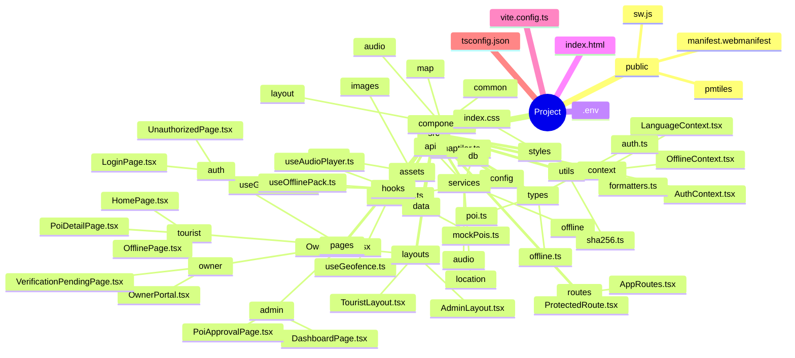

```mermaid
mindmap
  root((Project))
    public
      sw.js
      manifest.webmanifest
      pmtiles
    src
      assets
        images
        icons
      components
        common
        layout
        audio
        map
      config
        constants.ts
        maptiler.ts
      context
        AuthContext.tsx
        LanguageContext.tsx
        OfflineContext.tsx
      data
        mockPois.ts
      hooks
        useGeolocation.ts
        useGeofence.ts
        useAudioPlayer.ts
        useOfflinePack.ts
      layouts
        TouristLayout.tsx
        OwnerLayout.tsx
        AdminLayout.tsx
      pages
        tourist
          HomePage.tsx
          PoiDetailPage.tsx
          OfflinePage.tsx
        owner
          OwnerPortal.tsx
          VerificationPendingPage.tsx
        admin
          DashboardPage.tsx
          PoiApprovalPage.tsx
        auth
          LoginPage.tsx
          UnauthorizedPage.tsx
      routes
        AppRoutes.tsx
        ProtectedRoute.tsx
      services
        api
        db
        location
        audio
        offline
      styles
        index.css
      types
        poi.ts
        auth.ts
        offline.ts
      utils
        sha256.ts
        formatters.ts
    .env
    index.html
    vite.config.ts
    tsconfig.json
```
